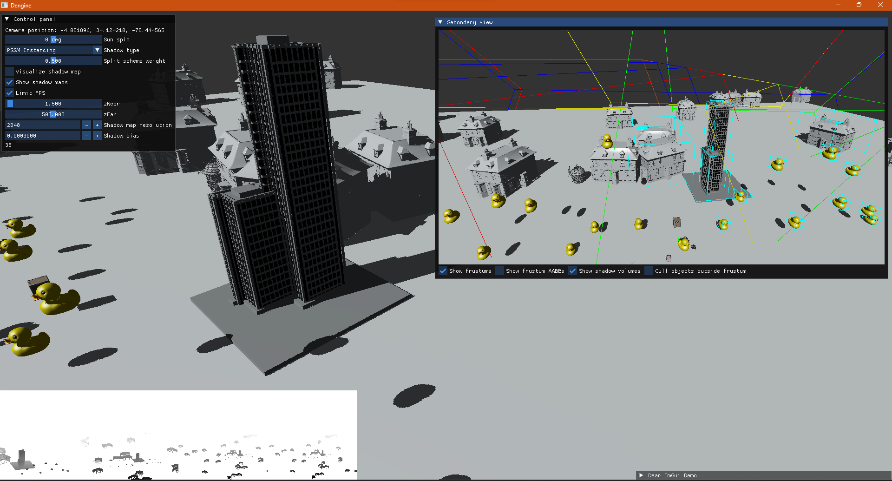

# Parallel-Split Shadow Maps 

*Semestral project for the BI-PGR class at Czech Technical University in Prague*

This projects implements the Parallel-Split Shadow Maps (PSSM) described in [this GPU Gems 3 article](https://developer.nvidia.com/gpugems/gpugems3/part-ii-light-and-shadows/chapter-10-parallel-split-shadow-maps-programmable-gpus).
Runnable executable can be downloaded [here from Mega.nz](https://mega.nz/file/8Zt1HAJS#dwuT32N2Xb0_Hk7tt4SqbKg57PLNxouWwTPCkb7fR7c).

Three shadow map methods are implemented, the "Regular" simple single shadow map method and two single pass PSSM methods described in the article.  
One using the geometry shader to duplicate geometry into multiple split frustums and other using instanced rendering. Both ultimately use a geometry shader to select a layer of a 2D texture array to render into.

The practical split scheme is used for splitting the camera frustum into sub-frustums and only basic axis aligned bounding box collision testing is employed for finding objects intersecting with frustums as well as objects who can potentially project their shadows into a frustum (sweeping aabb test).

Each of the three methods can be compared and switched in the UI, a controllable secondary view of another camera is also provided which can also display all the frustums, their bounding boxes as well as the actual frustums used to render individual shadow maps.  
Objects that aren't rendered in the main view can also be hidden from the secondary view to display which objects are culled by the camera frustum. 

The project was a bit rushed, so the performance metrics are not very in depth. The main metric is the FPS provided by the ImGui Demo window (Tools -> Metrics/Debugger).
Using the UI and secondary view the PSSM scheme can be inspected in depth and each method visually compared.

Generally speaking, the "Regular" method performs by far the best as expected but obviously yields unsatisfactory results as it's frustum used for rendering the shadow map spans the entire camera frustum.

The PSSM improves on this but in its current state where it's using just basic aabb collision tests there is a lot of room for improvement. Simple SAT based frustum tests can allow the individual split frustums to shrink down significantly.
The two single pass methods are performing very similarly. With the instanced method performing just a bit better from my observations.

## Controls
### UI
* Control panel
  * Sun spin - Changes position of the sun
  * Shadow type - Method used for rendering shadows
    * PSSM Instancing - The single pass PSSM method using instanced drawing
    * PSSM Geometry shader - The single pass PSSM method using geometry shader to duplicate vertices
    * Regular - A simple single shadow map method, uses the "scene-independent" logic to fit the shadow map to the camera's frustum
  * Split scheme weight - The lambda parameter of the practical split scheme from the article
  * Visualize shadow maps - Color the render depending on which split frustum each fragment belongs to
  * Show shadow maps - Displays the individual square shadow maps in the bottom left corner of the screen
  * Shadow map resolution - Resolution of the individual shadow maps
  * Shadow bias - Adjustable shadow bias used to counter shadow map aliasing artefacts
* Secondary view - Shows the world from a second auxiliary camera, used to inspect the frustum of the main camera. The shadows in this view aren't meant to be correct.
  * Show frustums - Shows the individual split camera frustums
  * Show frustum AABBs - Shows the axis aligned bounding boxes of the camera frustums
  * Show shadow volumes - Shows the light frustums used to render individual shadow maps 
* ImGui Demo window - Can be used to show FPS metrics

### Camera controls
<dl>
  <dt>F</dt>
  <dd>Switch between pivot and FPS camera modes</dd>
</dl>

Pivot mode

<dl>
  <dt>RMB Drag</dt>
  <dd>Rotate camera around the pivot point</dd>
  <dt>MMB Drag</dt>
  <dd>Move the pivot perpendicular to the camera's direction</dd>
  <dt>Scroll</dt>
  <dd>Zoom the camera in and out from the pivot point</dd>
  <dt>Alt + LMB Drag</dt>
  <dd>Zoom the camera smoothly with the mouse</dd>
</dl>

Secondary view can be controlled in the same way when the mouse cursor is hovering over its window.

# More screenshots

# How to build and run using CMake

The project can be built using CMake (3.15+) and git

## Downloading dependencies

First dependencies must be downloaded. Dependencies are managed using git submodules.

Dependencies can be downloaded using a prepared CMake script that can be run with:

`cmake -P DownloadDependencies.cmake`

If the repository was cloned from remote origin or its downloaded archive containes the `.git` folder all that's needed to do is run:

`git submodule update --init --recursive `

Either of these commands should download the necessary dependency repositories into the `libs` folder.  
This only needs to be done once before building the project.

Now the CMake build script can be run.

## Building

Preferably the Ninja build system should be used.
In that case make sure Ninja is installed.

Following two commands build the project:

    cmake -G Ninja . -DCMAKE_BUILD_TYPE=<build-type>
    cmake --build . -j<thread-count>

`<thread-count>` := Number of CPU threads to use for building.  
`<build-type>` := Build type, should be `Release` for maximum performance. 
Choices are `Debug`, `RelWithDebInfo`, `Release` (and `MinSizeRel`)

Example (Release, Ninja build system and 8 threads):

    cmake -G Ninja . -DCMAKE_BUILD_TYPE=Release
    cmake --build . -j8

You can also let CMake choose which build system to use automatically by omitting the `-G Ninja` parameter.
	
## Running
After the project is built, the executable binary will be located in the `bin/<build-type>` folder. 
For the Release build type that would be `bin/Release`.